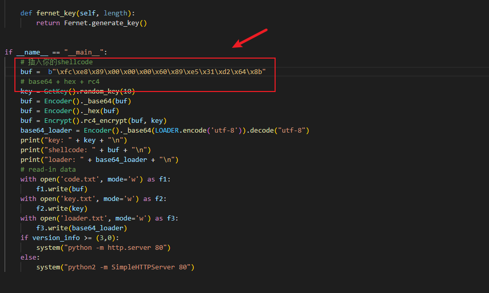
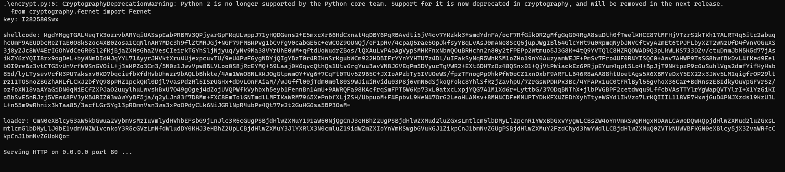
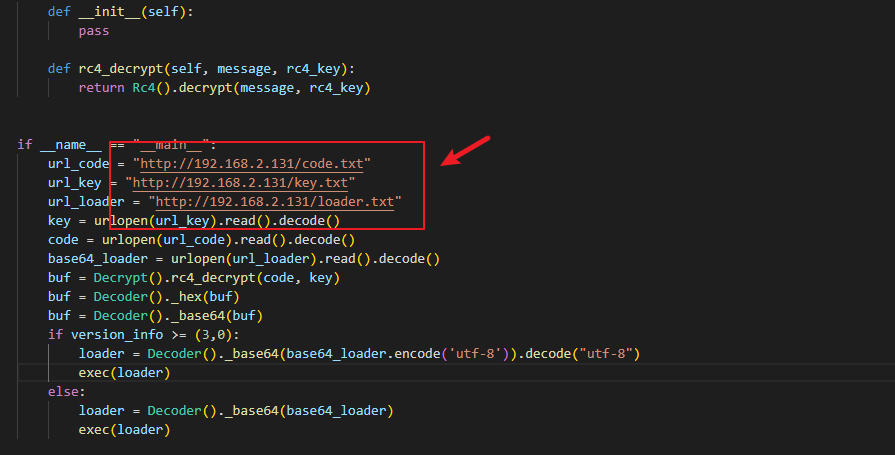

### Bypass测试  
在`encrypt.py`文件中，替换你的shellcode：

  

执行：`python2 encrypt.py`  

  

在`Jbypass.py`文件中，替换成你的服务器地址：

  

python2打包exe：`pyinstaller.exe -F -w .\Jbypass.py`

火绒测试：

  

360测试：    

   

WD测试：  

